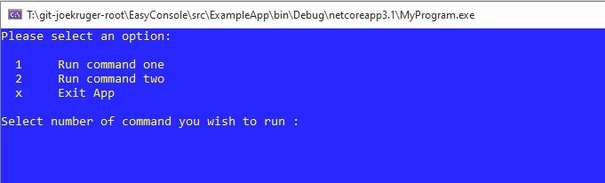

# EasyConsole

**Created** : 10 March 2021

Just a simple library to provide a way to create multiple commands or tasks that can be displayed in a menu and run asynchronously. The example app give a good idea on how to use it. I am planning to extend it to automatically add appsetting.json file and add it to the services collection.

I'm brand new to github and I only just created this, so will be adding to it as I go along.  Feel free to add comments or submit pull requests.  Once I figure out how I'll publish it to as a nuget package.

This is what the simple menu looks like currently.  Will add some bells & whistles in due course....

### Getting started
Simply instantiate a ConsoleApp passing in two optional  delegates to configure options and setup dependency injection.

### Creating Command

Create commands that extend EasyConsole.CommandBase.  Constructor parameters can be defined andwill be resolved by the service provider, which is also passed in to the execute function. 

